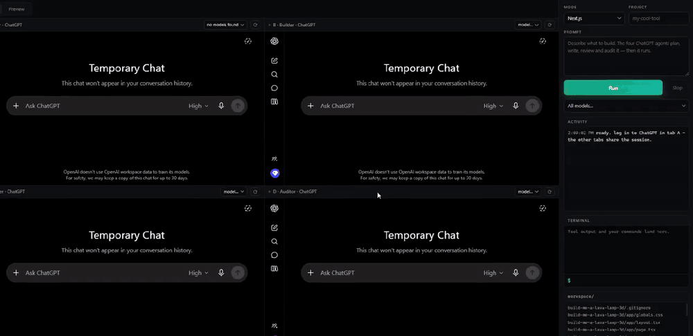
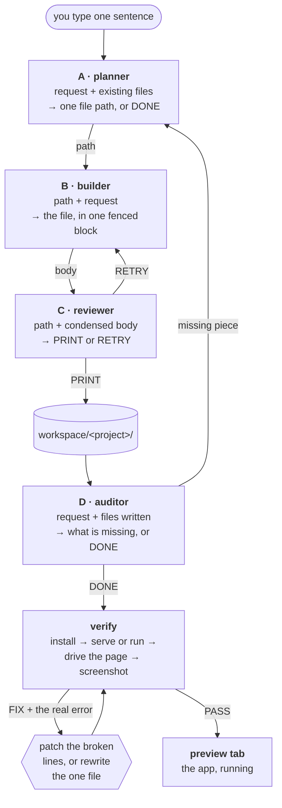

<h1 align="center">BrowserSmith</h1>

<p align="center">
  One sentence in. A running app out. No API key.
</p>

<p align="center">
  <a href="https://github.com/soufian3hm/BrowserSmith/actions/workflows/ci.yml"></a>
  <a href="https://github.com/soufian3hm/BrowserSmith/releases"></a>
  <a href="LICENSE"></a>
  <a href="https://github.com/soufian3hm/BrowserSmith/stargazers"></a>
</p>

<!--
  TODO (maintainer): record docs/demo.gif — 20-30s, no cuts: type one sentence
  into the sidebar, the four tabs light up in sequence (plan, build, review,
  audit), the terminal streams npm install, the Preview tab shows the finished
  app running. Then delete this comment and uncomment the line below.

<p align="center"></p>
-->

BrowserSmith is an Electron app that drives four ChatGPT tabs as a build team.
One tab plans the next file, one writes it, one approves or rejects it, one
audits the project against your request. When the files are written, the app
installs the dependencies, starts the dev server or runs the entry point,
screenshots the app after driving past its start screen, reads the real error
out of the framework's overlay, patches the broken lines, and shows you the
result. It automates the web UI rather than an API, so a free account works and
there is no key to paste anywhere.

**Three things make it different from a code-generating chat window:**

- **No API key.** It types into the same ChatGPT you already pay nothing for.
- **A running app, not a code dump.** Every project is installed, started and
  screenshotted before it is called done.
- **It reads real errors.** A Next.js error overlay lives in a shadow root and
  never appears in `document.body.innerText`. BrowserSmith reads it out, finds
  the file and line, and sends a surgical find/replace patch instead of
  regenerating a 48KB file.

## The loop



The reviewer never sees a whole file — it gets a head-and-tail condensation with
the middle elided, because it only ever answers one word. The planner and the
auditor decide when the project is finished; there is no file count to tune.

## Quickstart

**You need:** a ChatGPT account you are willing to log into, Node 22.13 or newer
(Electron's build tooling requires it), and a few hundred MB of disk for
`node_modules`. Windows is the platform this has been run on end to end; the
macOS and Linux code paths exist and are unit-tested in CI but have not been
exercised live.

```bash
git clone https://github.com/soufian3hm/BrowserSmith
cd BrowserSmith
npm install
npm start
```

1. **Log in once, in tab A.** All four tabs share the `persist:chatgpt`
   session, stored in `./.profile/` next to the app and git-ignored. Logging
   into one tab logs in all four.
2. **Pick a mode** (Auto, Next.js, Vite, Static, Node.js, Python). Framework
   modes write a real runnable scaffold first.
3. **Type the request. Press Run.** Watch the activity feed on the left and the
   build output in the terminal panel. When the app is up, the Preview tab
   switches on with the dev server still running; **Open** launches it in your
   real browser.

Every run lives in its own `workspace/<project>/` folder. Nothing is ever typed
into a chat by hand — the sidebar request box is the only control you touch.

**Autopilot** inverts that: turn it on, type your request directly into tab A's
ChatGPT, and the app notices it, builds the whole project, and posts a summary
back into that same chat.

**Terminal**: commands you type yourself run in the current project folder
(PowerShell on Windows, `/bin/sh` elsewhere). Commands the agents cause to run
never go near a shell — see [Privacy and safety](#privacy-and-safety).

## Modes

The mode shapes the role prompts and the scaffold. It does **not** decide how
the project is verified — that is derived from what is actually on disk after
the build, so a Python backend serving an HTML page gets both a server and a
browser preview.

| Mode | Scaffold written first | Definition of done the auditor judges against |
| --- | --- | --- |
| **Auto** | none | the project satisfies the request end to end, in whatever stack the planner chose, and its own entry point runs or serves cleanly |
| **Next.js** | `package.json`, `tsconfig.json`, next config, `app/layout.tsx`, `app/page.tsx`, `app/globals.css` | `npm run dev` serves the app and every import resolves |
| **Vite** | `package.json`, `index.html`, the `src/` entry | `npm run dev` serves the app and every import resolves |
| **Static site** | none | opening `index.html` straight from disk shows the complete result |
| **Node.js** | `package.json`, entry | `node index.js` runs cleanly |
| **Python** | entry, `requirements.txt` | `python main.py` runs cleanly |

Auto has no default and no example path in its prompt. Naming one biases every
project toward it — an earlier build of this app quietly answered "a next js
app" with a single `index.html`, so `inferMode` now returns `auto` unless the
request carries an explicit stack signal.

## How verification works

The build is not finished when the files are written. `toolchain.plan()` reads
the project directory and decides what kind of thing was actually built, then:

**1. Install.** A declared `dev`/`start`/`serve`/`preview` script is the
strongest signal there is, and the package manager comes from
`packageManager` or the lockfile on disk. Every other ecosystem (Go, Rust,
.NET, Java, Ruby, PHP, Python, Deno, shell, make) has a row in a table that
says how to detect it, install it and run it. If the runtime is not installed
on your machine, the plan says so in plain words instead of inventing a
verification the machine cannot perform.

**2. Run or serve.** One regex across every language answers the only question
that matters — does this listen on a socket, or does it print and exit? A
`flask` import and an `http.createServer` call are the same fact in two
languages.

**3. Drive the page, then screenshot.** Screenshotting the moment the page
loads produced FIX verdicts on perfectly working games, because what was on
screen was "PRESS ENTER TO DRIVE". So the harness clicks the centre of the
page, presses Enter and Space, then holds W and Right for about a second before
capturing. All of that is a no-op on a page that does not care. The reviewer is
told, in words, what was done to the page.

**4. Read the real error.** A screenshot proves the app is broken; it never
says why. Three sources are collected and pasted into the prompt as one field:

- the **framework error overlay**, pulled out of the shadow DOM
  (`nextjs-portal`, `vite-error-overlay`, the webpack dev-server overlay) —
  none of which appear in `document.body.innerText`;
- **console errors** at warning level and above, with file and line;
- the **dev-server output**, because a TypeScript failure or a bad import is
  printed by the compiler and may never reach the browser at all.

**5. Patch, do not rewrite.** A stack trace names a file and a line, so the
builder gets 80 numbered lines around it and is asked for a find/replace patch.
A patch is a few hundred characters either way; a rewrite costs a full
generation and risks regressing everything that already worked. Matching is
forgiving about indentation, because that is the detail models get subtly wrong
most often — and a FIND that matches twice is **refused**, because replacing
the wrong copy silently corrupts the file, which is worse than failing the
patch. If the builder says the fix cannot be expressed as a patch, it replies
`REWRITE` and the one file is regenerated.

Two fix rounds are spent before the run ends. Whether it passes or not, if
there is a URL, the preview is shown.

## What broke, and how it is handled

Every item here is a production failure that changed the code. They are the
reason this is an app and not a script.

**Synthetic events do not work when the window is not focused.** ChatGPT's
composer is a ProseMirror contenteditable, and ProseMirror ignores untrusted
key and paste events whenever the window is in the background — so an
unattended run types into nothing. All typing and focus now go through
the **main process** — `webContents.insertText` and `webContents.focus` — which
does not care what the OS thinks is in front. The renderer's own
`webview.focus()` is a no-op in the background, which is why popup menus used
to open in only one of four tabs.

**"The text stopped changing" is the wrong completion signal.** The echo of
your own prompt is growth, and it settles before the model starts answering. A
long code block renders into a `<pre>` whose text does not grow tick by tick,
so the transcript can sit perfectly still mid-stream — an early "stalled while
generating" escape hatch fired there and handed the reviewer 2518 characters of
an unfinished file. The authority is now the UI's own **stop button**: while it
is on screen, `awaitReply` will not return, full stop. Its identity is
re-checked on every poll rather than cached, because the site swaps stop back
to send by re-rendering the *same element* with new attributes — a cached node
would report "generating" forever. And the filter that drops status lines
("Thinking", "Searching the web") keeps **blank lines**: an earlier version
stripped them and silently removed every paragraph break from every file the
app had ever produced.

**Chats go unresponsive, and a blind chat stays blind.** ChatGPT virtualizes
long threads — old messages unmount as new ones stream — which blinds any
growth-based reply detector. After one 13KB code reply, every later read on
that tab timed out. Tabs now rotate to a fresh chat past 12KB and reseed their
role contract automatically; every prompt is self-contained, so nothing is
lost. A tab that goes blind anyway (seen live at 5.5KB, so not a size problem)
gets a **hard reset**: navigate to a brand-new chat, wait for the composer to
mount, reseed. Retrying into the same dead composer never worked.

**A 51KB paste wedges the composer.** Typing a whole file into ProseMirror took
long enough that the tab looked hung, the readiness check timed out, and the
run silently skipped review entirely. The reviewer answers one word, so it now
gets a **condensed** body: about 2500 characters of head, 1500 of tail, and a
marker naming how many characters were elided. The reviewer's contract tells it
that marker is ours, never the author's.

**Node refuses to spawn `.cmd` files.** Since Node 20.12, spawning a `.cmd`
shim with `shell: false` throws `EINVAL` (CVE-2024-27980 hardening) — which is
every npm-family command on Windows. Those go through `ComSpec` as
`cmd /d /s /c npm ...`, with the argv still a fixed array of app-authored
strings, so nothing that came out of a model ever becomes part of a shell line.

**Autopilot triggered on its own relay traffic.** It watched tab A for new
messages, saw the orchestrator's own protocol messages arrive there, took over
a finished run and reported "0 files" over real work. It now reads only the
delta since its baseline, rejects anything matching its own protocol
vocabulary, ignores bare control words, and holds a 30-second cooldown after
every run.

**"Here is the file:" was being written into files.** Stripping one fence that
wraps the whole reply is not enough — ChatGPT splits one file across several
code blocks, wraps blocks in prose, and sometimes emits no fences at all.
`extractBody` handles every shape that has actually come back, drops sidecar
blocks (`bash`, `console`, `diff`) when a real one survives, and returns an
empty string when nothing file-shaped is left, so the caller retries instead of
writing an apology to disk. One live run produced an `index.html` with a stray
` ``` ` inside its `<style>` block — valid-looking HTML with silently corrupted
CSS after it.

## MCP server

```bash
npm run mcp
```

Exposes `workspace_list`, `workspace_read` and `workspace_write` over stdio, so
Claude Code, Cursor or any MCP client can read and write the same workspace the
agents build into:

```bash
claude mcp add browsersmith -- node ./src/mcp/server.js
```

## Limitations

Stated plainly, because you will hit these.

- **It automates a web UI.** A ChatGPT redesign can break the driver. Nothing
  here depends on a generated class name, every hook falls back to a
  geometry/role heuristic, and there is a runtime element picker (Advanced →
  Element pickers: click a picker, then click the element) to re-teach a
  selector without editing code. It still degrades rather than breaks — but it
  can degrade.
- **Rate limits are real.** A typical project sends roughly 20-40 messages: one
  planner, one builder, one reviewer and one auditor exchange per file, plus
  seeding and verification rounds. Retries and fix rounds push it higher. On a
  free account, a non-trivial project will stall on a message cap.
- **Verified on Next.js, static sites and Node CLIs.** Vite, Python, Go, Rust,
  .NET, Java, Ruby, PHP and Deno all have runtime rows and are detected and
  planned, but they are far less exercised. Reports on those are welcome and
  useful.
- **Windows is the tested platform.** `npm run package:win` produces an
  installer, a portable executable and a zip, all built and run from a Windows
  machine. The macOS and Linux targets are configured and the code paths are
  unit-tested in CI, but neither has been built or executed.
- **Builds are unsigned.** Windows SmartScreen will show "Unknown publisher" on
  first launch, and macOS Gatekeeper will refuse an unnotarized build outright.
  Code signing is not currently planned.
- **The model chooses the stack in Auto mode.** That is the point, and it is
  also a source of variance between runs.

## Privacy and safety

- **No API keys.** Nothing to paste, nothing to leak, nothing to bill.
- **Temporary chats.** Every tab opens `?temporary-chat=true`. Those
  conversations are not saved to your history.
- **Your session stays local.** Cookies live in `./.profile/` next to the app
  and are flushed aggressively so a hard kill does not lose the login. The app
  never reads or exports cookie *values* — the session pill shows cookie names
  and expiry dates only, and Forget login wipes the folder.
- **The workspace is a sandbox.** Model replies are untrusted input. Paths are
  rejected twice — once by the parser (a path containing `..` is never accepted
  as a file path) and once by the filesystem layer, which resolves every path
  and throws if it lands outside `workspace/`.
- **No absolute paths ever enter a chat.** Prompts carry project-relative paths
  only, so your OS username is never sent anywhere.
- **AI-driven commands are allow-listed and shell-free.** Only a fixed set of
  executables can be launched, the argument arrays are built by the app rather
  than by model output, and every spawn is `shell: false`. The terminal panel
  is a separate channel that runs a real shell — for commands *you* type, and
  only those.
- **`npm install` runs a `package.json` that a model wrote. That is a real
  risk.** Install scripts execute arbitrary code, and this app runs them on your
  machine by design, because that is what building a real app requires. The
  blast radius is your user account, not just the project folder. If that is not
  acceptable for your setup, run BrowserSmith in a VM or a container. The
  generated `package.json` is on disk and readable before anything is installed.

## FAQ

**Do I need an API key or a paid plan?**
No key. A free account works, and will hit message caps on anything
substantial — see [Limitations](#limitations).

**Will this fill up my ChatGPT history?**
No. Every tab runs in a temporary chat, and tabs rotate to a *new* temporary
chat by navigation rather than by clicking "New chat", which would open a saved
conversation.

**Can I choose the model?**
Yes, per tab, from the sidebar. Reading the model list opens the site's own
dropdown and closes it again without changing anything.

**Why four tabs instead of one long conversation?**
Because each role has a different contract and a different failure mode. The
reviewer that answers `PRINT` or `RETRY` in one word is only reliable while its
context contains nothing but one file. Splitting the roles also means a wedged
tab costs one round, not the run.

**Can I point it at a different chat product?**
That is the intent — everything site-specific (name, URL, auth cookies, login
hint, new-chat behaviour) lives in `src/shared/site.js`. The DOM knowledge in
`src/main/preload-chatgpt.js` would need its own pass.

**Where do the projects go?**
`workspace/<project>/`, in the repo root during development, next to the
executable in a packaged build.

**Can I point it at an existing codebase?**
Not yet. It writes into its own workspace folder, and the sandbox is what makes
running model-authored code tolerable.

## Troubleshooting

| Symptom | What to do |
| --- | --- |
| All four tabs show a login screen | Log in **once, in tab A**. The other three share the session. |
| A run stalls at "seeding B" | The tab is wedged. It hard-resets and retries once on its own; if it keeps happening, use Advanced → Self-test to check the live DOM without sending anything. |
| Replies stop being detected after a big file | Expected, and handled: the tab rotates to a fresh chat past 12KB, and a build attempt whose reply never arrives hard-resets that tab before the next try. To force it, switch mode — that clears every seed, and each reseed hard-resets a tab it cannot read. |
| ChatGPT changed and the send button is not found | Advanced → Element pickers → Send, then click the real button. The override is remembered. |
| "command not allowed: X" | `X` is not on the allow-list in `src/main/toolchain.js`. Add it there deliberately, or run it yourself in the terminal panel. |
| `npm install` fails on a generated `package.json` | Read it — it is plain text in `workspace/<project>/`. The model invented a package that does not exist more often than anything else. |
| Python or Go project "detected but not runnable" | The runtime is not installed. The auditor is told this explicitly and will not treat it as a defect in the code. |
| Windows SmartScreen on a portable build | The build is unsigned. More info → Run anyway, or build it yourself from source. |

## Contributing

Read [CONTRIBUTING.md](CONTRIBUTING.md) first — it documents the dev loop and
the non-negotiable rules, each of which was learned from a production failure
and undoing one silently breaks live runs.

```bash
node --test                     # the whole suite; finds new test files on its own
node --check src/main/main.js   # parse an Electron file without launching Electron
npm run lint && npm run format:check
```

Security issues go to [SECURITY.md](SECURITY.md), not to the issue tracker.

## Licence and disclaimer

MIT — see [LICENSE](LICENSE).

BrowserSmith is not affiliated with, endorsed by, or sponsored by OpenAI.
ChatGPT is a trademark of OpenAI. This app automates the ChatGPT web interface,
which may conflict with OpenAI's Terms of Use; you are responsible for your own
account and for how you use it.
